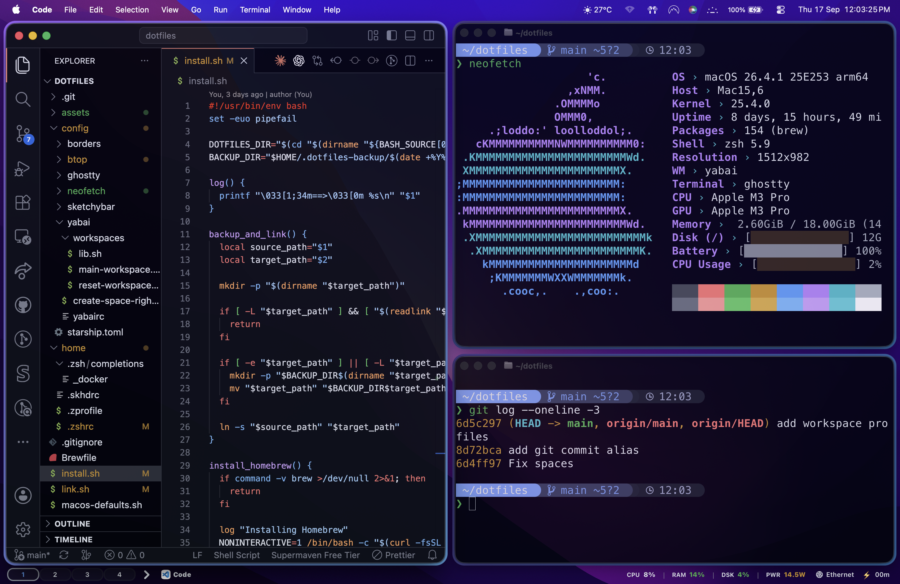

# Klest's Dotfiles

This is the macOS setup I use every day. Zsh, yabai, skhd,
SketchyBar, Ghostty, Starship, borders, and btop. Nothing here is meant to be
universal; it is a working setup that I keep improving as I use it.

## Workspace



The main workspace shortcut creates four Spaces:

- Code with two Ghostty windows
- Arc
- WhatsApp and Telegram
- Finder at Downloads with two more Ghostty windows

`right cmd + right option + shift + 1` builds that workspace. `right cmd +
right option + shift + 0` asks for confirmation, then closes visible apps and
reduces Spaces back to one.

## Start Here

Read through `install.sh` before running it. It installs Homebrew packages,
links the configs, applies the macOS defaults, and starts the window-management
services. Existing files are backed up to `~/.dotfiles-backup/<timestamp>`.

```sh
git clone https://github.com/Klest-Lazaj/dotfiles.git ~/dotfiles
cd ~/dotfiles
./install.sh
```

To only link the configs without installing packages:

```sh
./link.sh
```

To apply only the macOS animation defaults:

```sh
./macos-defaults.sh
```

## What's Included

- `home/` contains shell and skhd configuration.
- `config/yabai/` contains tiling rules, Space helpers, and workspace profiles.
- `config/sketchybar/` contains the menu-bar setup.
- `config/ghostty/`, `config/btop/`, `config/neofetch/`, and `config/starship.toml` contain terminal tooling.
- `Brewfile` lists the Homebrew dependencies.

## A Small Heads-Up

Yabai, skhd, SketchyBar, and borders need macOS permissions before they can do
their job. In particular, Accessibility access is required. The reset workspace
shortcut is intentionally destructive after its confirmation prompt, so do not
use it with unsaved work open.

This Yabai setup also uses the scripting addition. My Mac has a custom SIP
configuration with filesystem, debugging, NVRAM, and boot-argument protections
disabled. That is less secure, unsupported by Apple, and can break after macOS
updates. The installer does not change SIP; only use this part of the setup if
you understand and accept that tradeoff.
